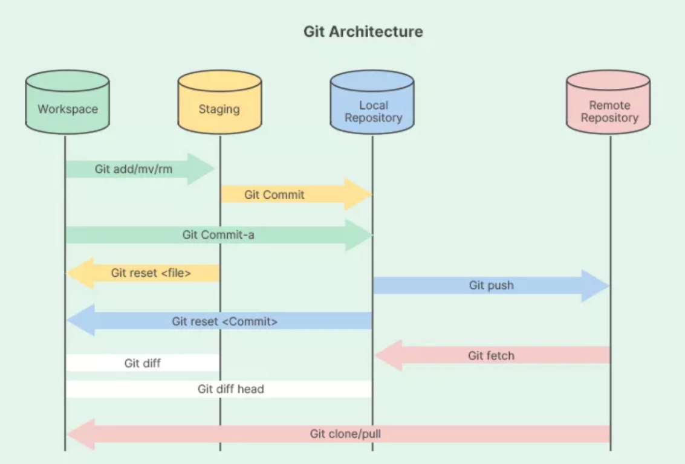

Git Command List 

There are mailny 4 component git version contorl

Workspace---> Stagging ----> Local Repository -----> Remote Repository

first 3 steps are related to local system
Last item is part of cloud system

BASIC SETUP

git config --list (Show All Config Values - local, global, system)
git config --global --list  (Git configuration global settings )
git config --global user.name "Your Name"  (Define a user name)
git config --global user.email "azam@example.com" (Define an email id for a user name)
git config --global user.name (to fetch current username)
git config --global user.email (to fetch current username's email id)

BASIC COMMANDS

git init (to initialize a zit repo)
git status (check current status of repo)
git add filename.ext OR git add . (move file or full work to staging area)
git commit -m "commit message"
Create a .gitignore file and add files/folders that doesn't need tracking.

COMMIT VIEWING

git log see details for all the commits
git log --oneline (1 liner details for all commits)
git log --stat (details of changes at each commit level)
git log -p (see code changes at commit level)
git show <6 digit sha id> (see changes on specific commit)
git diff (changes made within staging area before commit)

BRANCHING AND MERGING

git branch <branch_name> <sha_id>(creates a new branch)
git branch (lists all branches)
git checkout <target_branch_name> (switch to another branch)
git log --oneline --all (see commits of all branches)
git log --oneline --all --graph (graph of commits from all branches)
git branch -d/-D <branch_name> (deletes a branch, checkout to other branch before deleting)
git merge <branch_name> (run from master/main)

HANDLING REMOTE REPOITORY 

git remote add origin <url> (sets origin as the remote name pointing to URL)
git push origin master (sends local repo(from main/master) to origin(to cloud))
git push -u origin main (sets the upstream so future git push and git pull can be done without specifying branch name)
git pull origin main (Fetches changes from origin/main and merges into your current branc)
git clone <url> (download/copy remote repo)

UNDERSTANDING SOFTWARE VERSIONS --> V.1.O.O
git tag -a <sha(optional)>
Vim editor:
Fn+insert — write a message
:wq — save and quit
git log (check if tagging was done successfully)
git tag -d v 1.0.0 (delete the mentioned tag)